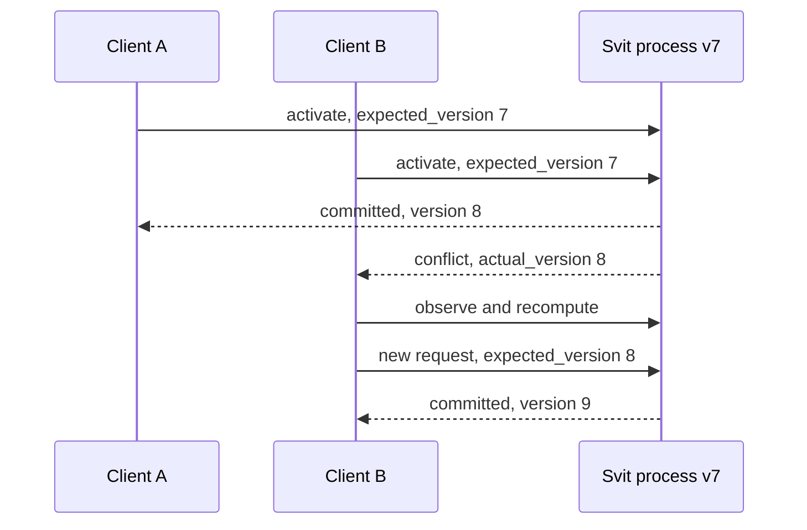
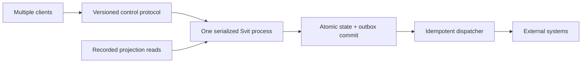

# Controlling a Svit process

Multiple clients can safely submit work to one Svit process through Svit
Control Protocol 1. The protocol is transport-neutral: a host may expose it over
an in-process API, HTTP, gRPC, WebSocket, or another authenticated transport.

The protocol implements **VAST: Versioned Atomic State Transitions**. VAST is
the concurrency and commit model; `svit-control@1` remains the wire protocol
major.

The current implementation provides the in-process reference controller. It
does not yet provide a network server or authentication.

A network adapter must cap request bytes before decoding the envelope. The
controller validates already-decoded values against the process limits.

`svit-control@1` is the wire protocol major. It is independent of the Rust
crate version. Within major 1, clients ignore unknown fields on known messages;
an unknown operation is rejected. This permits additive evolution without
silently accepting behavior a client did not negotiate.

## VAST transaction model

One activation is one transaction. It can update memory, save scripts, and
append message or effect intents. Those changes commit together as one new
process version, or all remain unchanged.

For a process at version `N`, a matching request either commits one complete
version `N + 1` or leaves version `N` unchanged. A stale request conflicts
without executing guest code. Concurrent transitions are not merged: one may
commit, while the others must observe the new state and recompute.

```text
expected_version != N  -> conflict; state remains N
expected_version == N  -> commit N+1 or reject with state still N
```

VAST is a per-process claim at one serialization point. It does not provide
distributed consensus or prevent two unfenced hosts restored from the same
snapshot from diverging.

Every request supplies the version it expects:

```json
{
  "protocol": "svit-control@1",
  "client_id": "agent-a",
  "request_id": "turn-42",
  "process_id": "svit://local/example/planner",
  "expected_version": 7,
  "command": {
    "operation": "activate",
    "script": "plan",
    "input": {
      "type": "map",
      "value": {
        "goal": { "type": "string", "value": "prepare release" }
      }
    }
  }
}
```

The controller checks `expected_version` at the same serialization point as the
commit. If two clients race version 7, one may commit version 8. The other gets
a conflict and cannot overwrite the first client's work.

All requests for the process must reach the same active controller. The
in-memory adapter is not a distributed lease; a multi-host service needs fenced
process ownership before it can preserve this guarantee across hosts.



## Retry safety

`(client_id, request_id)` is an idempotency key. `client_id` is a client-chosen
namespace, not a user identity or connection identifier. `request_id` is not a
transport correlation ID. Retrying the identical request returns its stored
result while the receipt is retained. Reusing that key for different content
is rejected.

Receipts are bounded. Even after a receipt is evicted, the old version
precondition prevents the activation from committing twice. A durable host must
store the receipt atomically with the process commit to replay results across a
host crash.

## External systems

The transaction covers Svit state and committed outbox intents—not the external
world.



Read-only projection data should enter an activation as recorded input. A write
to an external system should become an intent committed to the outbox and
dispatched afterward. This avoids partial Svit state, but it does not create a
distributed transaction or make external effects exactly once.

## Identity

`client_id`, `request_id`, and `process_id` are identifiers, not credentials.
The future transport adapter must authenticate the caller and authorize access
outside the client-controlled envelope. It must perform authorization before
receipt lookup and partition receipts by its trusted tenant boundary.

## Protocol evolution

Svit follows the maintenance pattern used by Mira and the Agent Client
Protocol: Rust wire types are canonical, compatible additions use optional
fields and negotiated capabilities, and generated schemas plus conformance
tests prevent SDK drift.

The in-process protocol currently has no optional operations. Before a remote
transport is declared stable, it will require an initialization exchange for
major-version selection, capabilities, implementation information, and the
binding's authentication requirements. Capabilities describe supported
behavior; they do not authorize access.

Generated schema artifacts and cross-version SDK tests are not implemented
yet, so the current JSON representation is a research interface rather than a
stable public wire release.

Run the two-client example:

```console
cargo run -p svit --example multi_client_control
```
