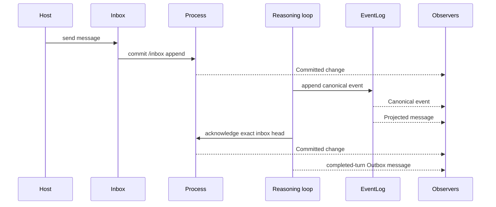

# Events

Svit exposes several related signals with different durability and ownership.
They are intentionally not one undifferentiated event stream.

| Signal | Meaning | Durable source |
| --- | --- | --- |
| `SvitEvent::Committed(Change)` | Process state changed; carries version, changed paths, and available content hashes, but no values | Process transaction stream when persistence is configured |
| `SvitEvent::CanonicalEvent(Event)` | One canonical reason/act record was appended | Paged `EventLog` |
| `SvitEvent::Message(Message)` | A presentation message derived from that canonical event | Rebuilt from the canonical event |
| `Outbox` message | One turn completed with an assistant response | Transient completion signal |
| `SvitEvent::Failed` | The independent process loop stopped | Transient sanitized diagnostic |

## Runtime surface

`Svit::events()` creates an independent observer for operational events.
`Svit::outbox()` creates an independent observer for completed-turn responses.
Both are bounded live streams for one runtime lifetime; neither is a durable
audit API.

`Svit::recent_events(limit)` reads a bounded newest window from the canonical
reasoning history. `Svit::recent_messages(limit)` projects messages from that
history. Use these reads to initialize or recover a presentation, then use the
live observer for new activity.

The canonical event is published before its derived message. A completed-turn
outbox message is sent only after the corresponding inbox item is acknowledged.
If the turn fails, the inbox item remains committed for recovery, no completed
outbox response is published, and event observers receive a bounded sanitized
failure.

## Consuming commit notifications

`Committed` is an invalidation signal, not a state payload. Its paths identify
what may be stale. The host reads an owned value back through `Svit::read` or
uses `Svit::read_versioned` when the value and process version must come from
one observation.

Content hashes let a cache retain an unchanged subtree even when an ancestor or
descendant path was touched. A removed path has no resulting hash. Mounted
content has no committed content hash because the source lives outside the
process.

Only writes performed through this process produce mount-path notifications.
An external edit to a mounted folder or database does not emit a Svit event, so
a host caching mounted data must refresh it according to its own policy.

## History and snapshots

Canonical reasoning events are host infrastructure partitioned by process and
session. With the local persistent adapter they live in a paged `EventLog`; a
volatile Svit keeps them in memory for its lifetime. `/thread` contains bounded
session metadata, not the event history.

Process snapshots therefore do not grow with the conversation and do not carry
canonical event history. A process-only fork begins a fresh session. A durable
store fork can share the exact immutable event prefix and then append an
independent child history.

Process transactions and canonical reasoning events also have different
ordering domains: process version orders committed roots, transaction position
orders durable process envelopes, and event sequence orders canonical
reasoning records.

## Observer behavior

Create observers before starting the loop when the initial live sequence
matters. Each `events()` or `outbox()` call has its own cursor. A slow observer
can receive `ObserveError::Lagged`; it must treat the live stream as incomplete
and recover from bounded history and current process reads. Channel mechanics
remain private implementation details behind the Svit API.

The executable inbox and completed-turn behavior is covered by
[`process_reasoning.rs`](../crates/svit/examples/process_reasoning.rs).
