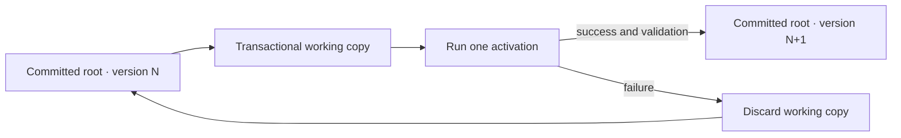

# Memory

The **memory tree** is the complete guest-visible namespace below one process
root. It includes `/memory`, `/lib`, `/ports`, `/mounts`, `/thread`, and the
other top-level nodes. **`/memory`** is one writable node inside that tree,
reserved for process-owned durable data.

This distinction matters: mounted data is visible through the memory tree, but
it is not copied into `/memory` or into a snapshot.

## Values

`/memory` stores bounded, serializable values:

| Kind | Contract |
| --- | --- |
| Null | No value |
| Boolean | `true` or `false` |
| Integer | Signed 64-bit integer |
| Number | Finite IEEE-754 double; NaN and infinity are rejected |
| String | UTF-8 text |
| Array | Ordered values |
| Map | Text keys in deterministic order |

Functions, host handles, interpreter state, cycles, and non-text map keys
cannot cross the commit boundary. Named executable source belongs under
`/lib`, not `/memory`.

Initial values supplied through `Svit::builder(...).memory(name, value)` are
part of process version zero. Later mutations use absolute paths such as
`/memory/release/color`.

## One operation vocabulary

Hosts, the reason/act loop, and Svit Lisp use the same path operations:

| Operation | Result |
| --- | --- |
| `discover(path)` | Deterministic immediate child names |
| `read(path)` | An owned value, or no value when the path is absent |
| `stat(path)` | Kind, access, locality, content shape, and other node facts |
| `write(path, value)` | Replace a writable memory value |
| `remove(path)` | Remove a writable memory value |

`Svit::read_versioned` returns an owned value and the process version from one
observation. Commit notifications identify stale paths; callers then read the
values they need instead of receiving a mutable process root.

## Commit boundary

An activation reads and writes a transactional working copy. A successful
activation validates the complete candidate state and commits it as exactly
one new process version. Any syntax, runtime, conversion, validation, or limit
failure discards the working copy.

Memory changes, named-script changes, and buffered message intents made by one
activation commit together. Direct host `write` and `remove` calls also build
and validate a replacement root before their single commit assignment.

External port effects are not memory transactions. If a script calls a port
and later fails, its memory changes roll back, but a completed HTTP request or
model call cannot be undone. See [Ports](ports.md).

## Persistence, snapshots, and forks

A process snapshot contains `/memory` together with the other committed process
state, its process version, and an integrity hash. It never contains an
executing stack, uncommitted work, host authority, mounted source data, or
canonical reasoning-event history.

Restore validates snapshot bytes as untrusted input before recreating the
committed process. Fork starts a child from one committed state. Parent and
child initially contain the same memory values, then commit independently; a
child mutation cannot change its parent or a sibling.

Each committed node has a structural content hash for its own subtree. An
unchanged subtree keeps its hash across commits, snapshots, and forks, allowing
clients to retain cached values precisely.

## Limits and trust

Memory is untrusted data even when a model or script created it. The process
limits bound value depth, container size, text size, and total persistent
state. Validation rejects cyclic collections, non-text map keys, non-finite
numbers, and unsupported interpreter values before commit.

The executable references for these semantics are
[`durable_counter.rs`](../crates/svit/examples/durable_counter.rs),
[`atomic_outbox.rs`](../crates/svit/examples/atomic_outbox.rs), and
[`fork_research.rs`](../crates/svit/examples/fork_research.rs).
