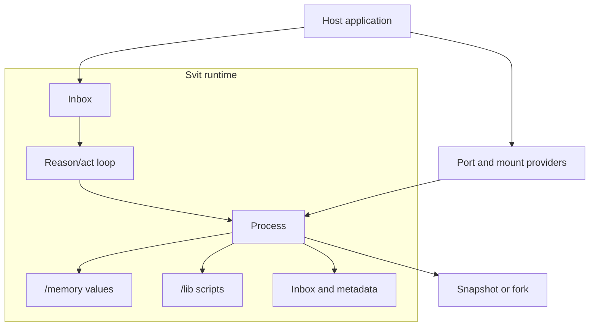

# Svit

**Memory and behavior, committed together.**

Svit is a research-stage Rust runtime for agents that need durable state and
reusable code. It keeps structured memory, named Svit Lisp scripts, inbox state,
buffered message intents, and runtime metadata in one serializable process.
Every activation runs against a bounded working copy and either commits one
complete next version or commits nothing.

One `Svit` owns one reason/act loop, one durable conversation thread, and one
serializable `Process`. The host chooses a `Reasoner`, mounts, and ports;
[Everruns](https://github.com/everruns/everruns) implements the current loop
behind the Svit API.

Svit is runnable and tested, but it has no stable release and is not a proven
hostile multi-tenant isolation boundary.

## Runtime model



Dashed gray boxes are host-owned context outside Svit. Blue boxes execute the
runtime loop, green boxes are committed process state, and violet is a portable
snapshot or fork boundary.

The process is the transaction and serialization boundary. The reason/act loop
uses the same path operations as the Rust host and Svit Lisp: `discover`,
`read`, `stat`, `write`, `remove`, and `exec`.

| Concept | Contract |
| --- | --- |
| [Memory](memory.md) | Durable process values, paths, transactions, snapshots, and forks |
| [Ports](ports.md) | Explicit host-owned integrations callable from Svit Lisp |
| [Events](events.md) | Process changes, canonical reasoning history, messages, and completed turns |
| [Control protocol](control-protocol.md) | Versioned atomic state transitions for multiple clients |

## Quick start

Create a Rust application:

```console
cargo new svit-quickstart
cd svit-quickstart
```

Add Svit while its public API is still changing:

```toml
[dependencies]
svit = { git = "https://github.com/everruns/svit", branch = "main" }
tokio = { version = "1", features = ["macros", "rt-multi-thread"] }
```

Replace `src/main.rs` with:

```rust
use svit::{Message, OpenAI, Reasoner, Svit, value};

#[tokio::main]
async fn main() -> Result<(), Box<dyn std::error::Error>> {
    let mut svit = Svit::builder("svit://local/quickstart")?
        .memory("facts", value!({}))
        .instructions(
            "Write requested durable facts to the exact process path before replying.",
        )
        .reasoner(Reasoner::new("gpt-5.6-terra", OpenAI::from_env()?))
        .build()
        .await?;

    let inbox = svit.inbox();
    let mut outbox = svit.outbox();

    svit.start()?;
    inbox
        .send(Message::user(
            "Write blue to /memory/facts/release_color, then confirm it.",
        ))
        .await?;

    let reply = outbox.recv().await?;
    drop(inbox);
    svit.block().await?;

    println!("{}", reply.text().unwrap_or_default());
    println!("stored={:?}", svit.read("/memory/facts/release_color")?);
    Ok(())
}
```

Run it with an OpenAI API key:

```console
OPENAI_API_KEY=... cargo run
```

## How a turn moves

1. `Inbox::send` commits the message to the process queue before waking the
   loop.
2. The loop appends canonical reasoning events to its paged event history.
3. Model tools inspect or change the process through the shared path API.
4. Each Svit Lisp activation commits memory, scripts, and buffered message
   intents once, or rolls them all back.
5. `Outbox` publishes the completed assistant response. `Events` publishes
   commit notifications, canonical events, derived messages, and sanitized
   terminal failures.

Hosts inspect state through owned reads; they never receive a mutable reference
to the process tree.

## Persistence and forks

The default `persistence-turso` feature stores one process transaction stream
and a separate paged reasoning-event history. Resume validates versions,
mutations, and structural hashes without rerunning guest code.

Snapshots preserve committed process state and thread metadata. A fork starts
from one committed root and then mutates independently; a child cannot change
its parent or siblings. Mounted source data and host port implementations are
never serialized.

The public API is still changing. Published changes are recorded in the
[changelog](../CHANGELOG.md).
