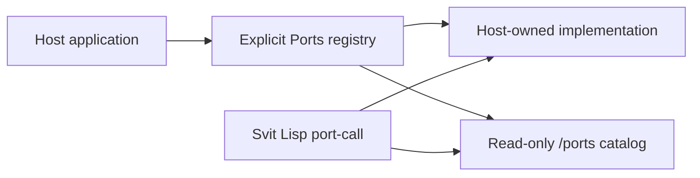

# Ports

A **port** is a host-owned typed integration that Svit Lisp can call by name.
Ports are how a host grants selected access to systems outside the process,
such as HTTP, another model call, or a local child Svit run.

Ports are explicit authority. `Ports::new()` grants nothing, and Svit has no
standard bundle that installs ports implicitly. The host registers each port
and passes the frozen registry to the `Svit` builder.

## Registry and catalog

Registration creates two things from the same source:

1. host-side dispatch for the installed implementation; and
2. a read-only descriptor under `/ports/<name>`.

Each descriptor contains the port name, contract version, description, JSON
input schema, output contract, effect class, and limits. Guest code can inspect
that catalog through `discover` and `read` before calling a port.

The catalog is descriptive, not authority-bearing. A snapshot may contain the
last catalog for inspection, but resume replaces it with the ports attached by
the current host. Stale `/ports` data cannot restore a missing grant.

## Built-in ports

The built-ins are registered independently:

| Port | Host grant | Effect boundary |
| --- | --- | --- |
| `http` | An allowlist plus host-selected transport; unrestricted HTTP is a separately named host configuration call | External request; redirects are not followed by the standard transport |
| `llm` | One host-selected `Reasoner` | One model call outside the process transaction |
| `spawn` | One host-selected child `Reasoner` | Fork the last committed state and run one local child turn |

`spawn` retains completed children in a host-local registry exposed through
`child_ids` and `child_snapshot`. It does not populate `/children`, persist the
child inside the parent snapshot, or provide scheduling or supervision.

`search`, `jq`, `discover`, `read`, `write`, `remove`, and `exec` are runtime
operations or Svit Lisp standard-library functions. They are not ports and do
not appear in `/ports`.

## Calling a port

Svit Lisp calls an installed port with `port-call`, passing one explicit value:
`(port-call "name" input)`. Input is converted to bounded JSON before host code
runs. The result returns to the activation as a JSON-compatible value or a
sanitized expected error.

When a script reaches a port call, Svit suspends guest execution, runs that
specific host implementation once, then replays only the pure guest segments
with the recorded result. All segments still form one activation and commit
the final working copy once.

The port's external effect cannot join that transaction. A later script failure
rolls back memory, scripts, buffered mount writes, message intents, and process
version, but it cannot undo a request already completed by an external system.
Hosts therefore need idempotency or reconciliation where retries matter.

## Custom ports

A custom `Port` supplies a `PortDescriptor` and an asynchronous `execute`
implementation. It receives:

- the explicit JSON input;
- a `PortContext` that can `read`, `stat`, and `discover` committed process or
  mount paths; and
- any explicit capabilities captured by the host-owned implementation.

`PortContext` has no process mutation method and provides no ambient shell,
filesystem, environment, or executable lookup. A custom native implementation
is still trusted host code and may exercise whatever authority its host
explicitly gives it.

Port inputs, call counts, diagnostics, and values that cross the persistent or
model-visible boundary are bounded. An activation-local result may be larger
only where the documented port contract permits the script to reduce it before
commit.

See the executable custom-port contract in
[`builtins.rs`](../crates/svit/examples/builtins.rs) and the broader boundary in
[Security](../SECURITY.md).
