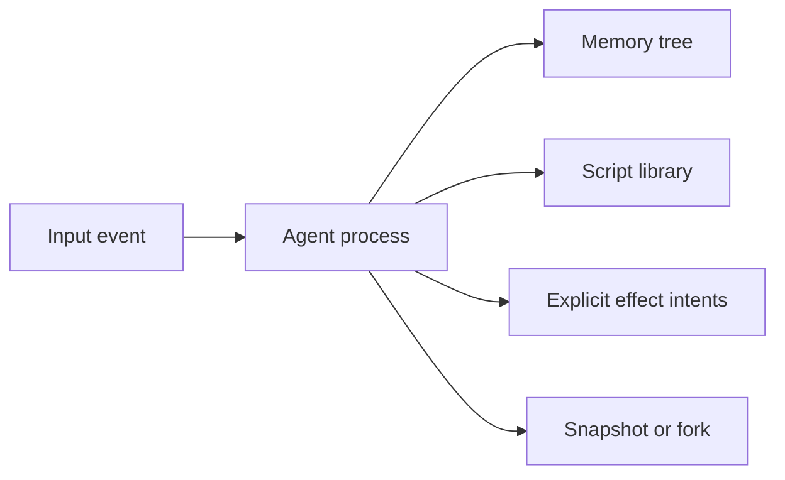

# Svit vision

Agents deserve an execution environment designed around their needs, not an
operating system inherited by accident.

Today, a general agent commonly receives a filesystem for memory, Bash or
Python for computation, operating-system processes for concurrency, and
environment credentials for authority. This works, but it also exposes a large
surface that is difficult to understand, move, inspect, constrain, or secure.

Svit explores a smaller foundation: an agent process runtime built from durable
memory, bounded computation, explicit effects, identity, communication, and
composition.

## The model

A Svit **runtime** is the Rust host that executes and supervises agent
processes. A Svit **process** is the isolated unit an agent owns. It contains
one durable state tree, a library of named scripts, an address, resource limits,
and eventually a mailbox, identity, capabilities, schedules, and lineage.

An **activation** is one bounded transition. It receives input, runs a named
script against a working copy, and either commits the resulting state and
effect intents together or commits nothing.

The process is portable data plus explicit semantics, not a directory with an
unbounded shell attached.

## One place to remember and act

All guest-observable durable state should be reachable through one structured
namespace. Agent memory and scripts live there. External resources can appear
there as projections, but a projection must state its authority, freshness,
cost, and consistency rather than pretending that remote state is an ordinary
local value.

Scripts are part of memory. An agent can discover, inspect, create, test, and
reuse its own functional library. This makes reflection a normal operation:
the agent can understand its state, available functions, limits, and granted
capabilities without inspecting interpreter internals.

Svit Lua is intended to be approachable and sufficiently general for agent
automation: math, text, collections, structured data, reusable functions, and
durable workflows. It is deliberately smaller than a general operating-system
environment.

## Processes compose

A committed process can be snapshotted, restored, moved, or forked. A fork
starts a new process from the same committed state and then evolves
independently. Sub-agents are therefore processes with an explicit lineage and
policy relationship, not hidden threads sharing mutable memory.

Processes communicate by addressed messages. An address identifies where a
message is intended to go; it does not grant permission. Identity,
authentication, and authorization remain separate concepts, with authority
represented by explicit, attenuable capabilities rather than ambient secrets.

## Security is part of the semantics

Resource limits, transaction boundaries, value validation, and authority
checks are not optional hardening. They define what an activation means.

The long-term goal is a runtime where important properties are stated precisely
and supported by the right evidence: tests, fuzzing, model checking, bounded
verification, or deductive proof. Claims must remain narrower than their
evidence. A sandboxed interpreter alone is not proof of hostile multi-tenant
isolation, and production deployments may still require a WebAssembly or
operating-system boundary.

## Research direction

The current implementation tests the smallest useful part of the idea:

- one serializable memory tree;
- named, self-authored Svit Lua scripts;
- bounded transactional activations;
- atomic state, script, and outbox changes;
- deterministic snapshots and isolated forks;
- reflection over memory and the script library;
- no ambient filesystem, network, process, environment, clock, or randomness.

The broader direction adds durable message delivery, schedules, globally
resolved process addresses, authenticated identity, capability-controlled
projections, migration, structural sharing, and stronger verification. Each
addition must preserve the small process model rather than recreate an
operating system inside the runtime.

## What success looks like

Svit succeeds if agents can perform long-lived work with a smaller and more
legible substrate than shell plus filesystem, while hosts can bound, audit,
snapshot, fork, and move that work without recovering hidden operating-system
state.

The research should also be allowed to fail. If restricted scripting is too
weak, reflection does not improve agent behavior, forks are not economical, or
secure containment costs too much, Svit may be more valuable as a focused
memory-and-automation capability than as a complete agent process runtime.

See the [README](../README.md) for the runnable implementation and its current
limitations.
