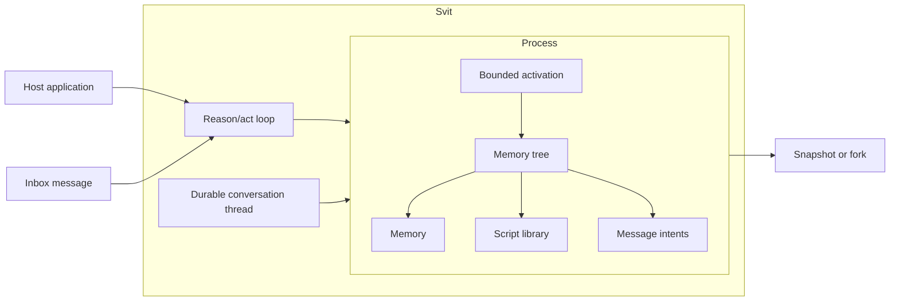

# Svit vision

Give the agent a space to remember, act, and evolve.

Svit keeps memory and executable behavior together in one structured,
self-reflective space. Agents can inspect it, script it, and evolve it through
bounded transactions.

That space should persist across activations and compose through snapshots,
forks, identities, capabilities, and messages.

Svit explores that space as a runtime for long-lived agent work. The goal is to
identify the primitives such work requires and design them together from first
principles.

## The model

A host application embeds one or more **Svit** instances. Each `Svit` owns a
reason/act loop, one durable conversation thread, and exactly one
**process**. The process is the serializable state machine: it contains the
memory tree, named scripts, address, limits, inbox, and committed thread state.
Everruns implements the current loop behind the Svit API, while a
**Reasoner** binds the selected model and provider. The broader model adds
delivery, authenticated identity, capabilities, schedules, projections, and
distributed ownership.

An **activation** is one bounded transition. It receives input, runs a named
script against a working copy, and either commits the resulting state and
effect intents together or commits nothing.

Controlled activations use **VAST: Versioned Atomic State Transitions**. A
request names the process version it observed. At the process serialization
point, it either commits one complete next version, is rejected without state
change, or conflicts because another transition already advanced the process.
VAST does not merge concurrent activations.

The process is portable data plus explicit transition semantics. A Svit
snapshot includes the committed conversation thread, so restore resumes its
history and fork creates an independent child process. The reason/act loop can
inspect the same space that Svit validates, commits, snapshots, and forks.

## One structured space

All guest-observable persistent state should be reachable through one
structured namespace. Memory and executable behavior live in the same value
model, giving the agent one variable space in which to remember and act.

A filesystem, network service, model, database, or other external resource may
be mounted into that space as a typed projection. A projection states its
authority, freshness, cost, and consistency explicitly. This lets the agent
work through one coherent interface while the runtime preserves the real
semantics of external state.

The current implementation supports both in-memory processes and a local Turso
adapter that durably stores one address-keyed stream of process transactions.
Each transaction mutates process state: memory, scripts, inbox/outbox, and
bounded `/thread` metadata. Canonical reasoning events use a separate paged
durable `EventLog`, while Everruns compaction checkpoints retain a compact
model context plus only its necessary raw suffix. Snapshots therefore remain
small. A durable fork shares the exact immutable event prefix and any checkpoint
within it; a process-only fork starts a fresh session.

The storage contract is designed so an object store such as S3 can store
immutable transaction objects and use a conditional head write as the commit
point. That mapping still needs an implemented adapter, single-owner fencing,
ambiguous-write recovery, durable control receipts, and executable distributed
evidence before Svit can claim Durable Object semantics.

## Scriptable and self-reflective

Scripts are process state. An agent can discover, inspect, create, validate,
and reuse its own functional library. Reflection is therefore a normal runtime
operation: the agent can understand its memory, available functions, limits,
and granted capabilities through the same structured space.

Svit Lisp is intended to be approachable and sufficiently general for agent
automation: math, text, collections, structured data, and reusable functions.
Its surface should grow from demonstrated agent tasks while remaining bounded,
versioned, and legible to both the agent and the host.

Memory and scripts evolve transactionally. A successful activation commits
validated memory, staged script changes, and buffered effect intents once. Any
failure preserves the previous committed space in full.

## Processes compose

A committed process can be snapshotted, restored, moved, or forked. A fork
starts a new process from the same committed state and then evolves
independently. This gives a child its own process with explicit lineage, state,
limits, and policy relationships.

Processes can commit addressed message intents. An address identifies where a
future dispatcher should send a message; it does not mean delivery occurred.
Identity, authentication, authorization, and reachability remain separate
concepts. Authority is represented by explicit, attenuable capabilities that
can govern projections, messages, and other effects.

The current implementation does not deliver those intents. Routing, delivery,
global addressing, identity, and capabilities remain future work.

## Security is part of the semantics

Resource limits, transaction boundaries, value validation, and authority
checks are not optional hardening. They define what an activation means.

The long-term goal is a runtime where important properties are stated precisely
and supported by the right evidence: tests, fuzzing, model checking, bounded
verification, or deductive proof. Claims must remain narrower than their
evidence. A sandboxed interpreter alone is not proof of hostile multi-tenant
isolation, and production deployments may still require a WebAssembly or
operating-system boundary.

## Research direction

The current implementation tests the smallest useful part of the idea:

- one process-owned conversation thread and reason/act loop implemented through
  Everruns;
- one serializable memory tree;
- named, self-authored Svit Lisp scripts;
- bounded transactional activations;
- atomic state, script, and outbox changes;
- snapshots, local durable replay, and isolated forks;
- reflection over memory and the script library;
- no ambient filesystem, network, process, environment, clock, or randomness.

The broader direction adds durable message delivery, schedules, globally
resolved process addresses, authenticated identity, capability-controlled
projections, object-store adapters, migration, structural sharing, and stronger
verification. Each addition must preserve a space the agent can inspect,
script, and evolve through explicit semantics.

## What success looks like

Svit succeeds if agents can perform long-lived work in a coherent space they
can understand and evolve, while hosts can bound, audit, persist, snapshot,
fork, and move that work through explicit semantics.

The research should also be allowed to fail. If restricted scripting is too
weak, reflection does not improve agent behavior, forks are not economical, or
secure containment costs too much, Svit may be more valuable as a focused
memory-and-automation capability than as a complete runtime for agent work.

See the [README](../README.md) for the runnable implementation and its current
limitations.
