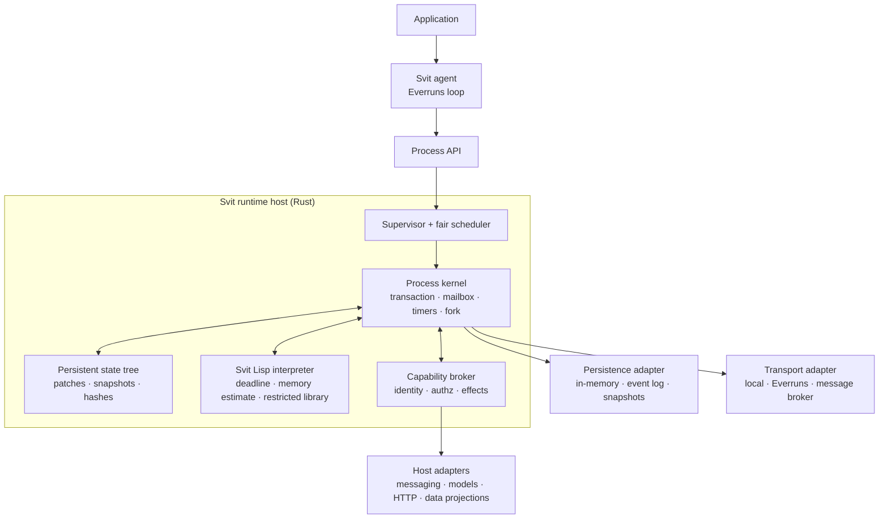

# Svit: an agent process runtime

Status: working research proposal
Date: 2026-07-31
Updated: 2026-08-05

## Executive summary

Svit should be a **capability-oriented agent process runtime** implemented in
Rust. A Svit host runs many isolated **agent processes**. Each process has:

- one guest-visible, serializable state tree;
- named Lisp scripts stored in that same tree;
- a mailbox, timers, identity, resource budget, and capability grants;
- transactional execution with no ambient filesystem, network, environment,
  clock, randomness, or process access;
- snapshots, copy-on-write forks, migration, and lineage;
- reflection over its state, scripts, APIs, limits, and granted capabilities.

The process is the unit an agent owns. The runtime is the Rust host that
executes processes. This terminology resolves the naming ambiguity without
inventing a new metaphor:

| Term | Meaning |
| --- | --- |
| **Svit runtime/host** | The Rust executor, scheduler, and security boundary |
| **Svit process** | One isolated, globally addressable agent state machine |
| **Activation** | One bounded response to a message, timer, or explicit call |
| **State tree** | The process's single durable guest namespace |
| **Projection** | A capability-controlled view of external state |
| **Script** | Named source plus metadata stored under the state tree |
| **Fork** | A new process created from a committed snapshot |

`Process` is the best name for the isolated unit because it naturally carries
state, identity, an address, resource limits, children, and a lifecycle.
`Runtime` remains the right name for the system that executes it. `VM` is too
language-specific, `sandbox` describes only one property, and names such as
`realm` or `capsule` would require new vocabulary without adding precision.
Internally, `kernel` is a useful name for the small trusted transition layer.

The strongest recommendation is to separate the **language** from the
**interpreter implementation**. Define a small, versioned "Svit Lisp" contract
and initially implement it with the pure-Rust Ketos interpreter. Ketos provides
a compact embeddable language and useful restrictions, but its deadline is
wall-clock based and its memory accounting is an abstract estimate rather than
an allocator byte cap. If same-native-process hostile multi-tenancy is a hard
requirement, Svit still needs stronger executable evidence and likely a
purpose-built, Wasm, or OS process boundary.

## 1. The hypothesis

Today's general agents commonly inherit an operating system abstraction:
files are memory, Bash or Python is computation, processes are concurrency,
and network credentials are authority. That is convenient but gives the agent
an enormous, historically accidental surface area.

Svit tests a different hypothesis:

> An agent needs durable state, computation, effects, identity, communication,
> time, and composition—but it does not necessarily need an operating system.

Designing those primitives together may produce an execution environment that
is easier for an agent to understand, cheaper to snapshot and fork, portable
across hosts, and much easier to constrain than a shell plus filesystem.

"In memory" should describe the normal execution model, not prohibit durable
storage. A process should run from an in-memory snapshot while its canonical
events and snapshots can be persisted, moved, or replicated by the host.

## 2. Goals and non-goals

### Goals

1. Present all **guest-observable durable state** through one namespace.
2. Provide approachable general scripting, math, collections, text handling,
   named libraries, and automation.
3. Make every external effect explicit, authorized, bounded, and auditable.
4. Support hostile multi-tenant execution with a precisely stated assurance
   level.
5. Give processes stable addresses, authenticated messaging, and delegation.
6. Make committed processes serializable, forkable, and migratable.
7. Let an agent discover and modify its memory and functional library within
   its permissions.
8. Own the agent lifecycle while using a replaceable reason/act engine; the
   initial implementation uses Everruns behind the Svit API.

### Initial non-goals

- POSIX, arbitrary executables, unrestricted Ketos modules, or compatibility
  with Scheme or Common Lisp ecosystems.
- Transparent serialization of an executing stack, arbitrary coroutine,
  closure with captured upvalues, userdata, or host pointer.
- Shared-memory concurrency between processes.
- Exactly-once delivery across arbitrary external systems.
- A new distributed database or consensus algorithm.
- A blanket claim that the whole production stack is mathematically proven.

The last point matters. Svit should produce explicit proofs or model-checking
evidence for named properties, not use "provably safe" as a marketing label.

## 3. Core invariants

The architecture should be judged against these invariants:

1. **No ambient authority.** Guest code can only request effects through an
   explicit capability granted to that process.
2. **One durable namespace.** Every durable value the guest can observe is
   reachable from the process root. Host secrets and enforcement state are not
   guest memory and remain outside it.
3. **Isolation.** A process cannot read or mutate another process without a
   capability naming the permitted operation and resource.
4. **Failure atomicity.** An activation commits its state patch and outgoing
   effect intents together, or commits neither.
5. **Bounded execution.** Every activation has finite compute, memory, state,
   host-call, output, and wall-time limits.
6. **Deterministic core.** Given the same committed state, input event,
   recorded external results, runtime version, and fuel, the core transition
   produces the same patch, intents, and result.
7. **Authority attenuation.** A child or delegated reference never gains more
   authority than its creator explicitly grants.
8. **Serializable boundaries.** Every committed process state has one
   versioned canonical encoding and content hash.
9. **Auditable effects.** Every external read, write, message, identity use,
   schedule change, and code change is attributable to an activation.
10. **Secrets are handles.** Private keys and provider credentials are never
    values available to script reflection.

"One namespace" must not mean one undifferentiated mutable guest namespace. Putting
authorization policy or private keys into a table that guest code can rewrite
would destroy the security model. Svit instead presents one tree containing
mutable values, immutable metadata, capability handles, and lazy projections.

## 4. High-level architecture



The core is an actor-like state machine. A process handles one event at a time,
which removes data races inside the process and makes replay, forking, and
formal reasoning substantially simpler. Parallelism comes from running many
processes and from explicit, host-controlled effect batches—not from shared
mutable state.

An abstract process can be described as:

```text
Process = {
  address, principal, version, root, mailbox, timers,
  grants, limits, lineage, status
}

activate(Process, Event, Budget)
  -> (new Process, StatePatch, EffectIntents, Result, AuditEvents)
```

This transition should be pure at the kernel boundary. External reads are
inputs whose returned values are recorded; external writes are intents that a
host adapter performs only after the commit boundary.

## 5. The single state tree

### 5.1 Shape

A process should expose a conventional default layout while allowing arbitrary
application data:

```text
/
├── memory/                 agent-owned durable data
├── lib/                    named scripts and libraries
├── tasks/                  durable schedules and workflow state
├── inbox/                  reflected message metadata/history window
├── children/               child addresses and lineage
├── mounts/                 projections of external resources
└── system/                 read-only runtime projections
    ├── identity
    ├── capabilities
    ├── api
    ├── limits
    ├── lineage
    └── runtime
```

The layout is a convention, not a set of unrelated stores. `memory`, `lib`,
and `tasks` are ordinary subtrees with different schemas and permissions.
`mounts` and `system` are nodes in the same namespace but are resolved by the
host.

### 5.2 Persistent value model

Do not persist arbitrary interpreter values. Define a smaller canonical data model:

```text
Value = null | bool | i64 | finite-f64 | text | bytes
      | list<Value> | map<text, Value>
      | content-link | process-ref | capability-ref | projection-ref
      | script-record
```

Recommended restrictions:

- maps have text keys only;
- lists are dense and ordered;
- graphs are acyclic unless represented with explicit links;
- depth, collection size, key size, and total encoded size are bounded;
- NaN and infinities are rejected from persistent state, or NaN is normalized
  to exactly one representation;
- scripts are source plus metadata, not serialized VM closures;
- references are typed values, not forgeable strings.

These restrictions make validation, canonical serialization, hashing,
querying, diffing, migration, and proofs tractable. Guest collections are
explicit immutable values during an activation, and every returned or staged
value must convert to this model before commit.

Use a structurally shared immutable tree internally. Each activation works
against a root version and builds a patch. Commit uses compare-and-swap on that
version. Unchanged nodes are shared, making snapshots and forks cheap.

For wire and snapshot encoding, start with a versioned deterministic CBOR
profile. DAG-CBOR is a useful design reference because it enforces string map
keys and a single encoding suitable for content addressing, but Svit should
only claim DAG-CBOR compatibility if it implements the complete required
profile. A root hash is an integrity and deduplication tool, not authorization.

### 5.3 Lisp view

Svit Lisp exposes state and effects through explicit functions. This keeps the
interpreter namespace separate from durable memory and makes each mutation or
message intent visible at the implementation boundary.

```lisp
;; /lib/counter.svit-script
(define (main input)
  (let ((count (+ (read "/memory/count")
                  (value-get input "/by"))))
    (write "/memory/count" count)
    (send! "process://owner" (value-map "type" "counter.changed"
                                         "count" count))
    (value-map "count" count)))
```

`write` changes only the activation's working copy. `send!` creates a
transactional outbox intent; it does not perform network I/O in the middle of
the state mutation. Future capability calls must likewise record their inputs,
results, cost, and authorization decisions.

### 5.4 External projections

Real-world state appears under `/mounts`, but a projection is not a magical
shared object. It is a typed capability with explicit semantics:

- **snapshot projection:** imported external data with source and version;
- **read-through projection:** a read calls the host and records its result;
- **write-through projection:** a write creates an authorized effect intent;
- **stream projection:** external changes arrive as process events.

Every projection declares freshness, consistency, read/write permissions,
cost, schema, and whether reads are replayable. This prevents the convenient
tree metaphor from hiding nondeterministic or irreversible behavior.

## 6. Scripting model

### 6.1 Recommendation: Svit Lisp, initially backed by Ketos

Lisp is a strong fit for the surface language: its syntax is small, code is
easy to generate structurally, and explicit functions make the state and effect
boundary clear. The first implementation uses **Ketos**, a pure-Rust embedded
Lisp, behind the Svit process boundary.

Ketos supports null host I/O, a denied module loader, execution deadlines, and
limits for call/value stacks, namespaces, syntax depth, integer size, and an
abstract guest-memory measure. Those controls are useful executable evidence,
not proof of hostile same-process isolation. In particular, the current crate
does not expose deterministic instruction fuel or an allocator-level byte cap.

Define the language contract independently:

- versioned Svit Lisp syntax and host API;
- deterministic persistent value semantics;
- no native modules or bytecode supplied by the guest;
- no guest module loader, filesystem/process APIs, host I/O, environment,
  clock, randomness, FFI, or native extensions;
- a fresh interpreter namespace for every activation;
- bounded syntax, integers, stacks, namespace, guest memory, and outputs;
- explicit clock, random, identity, messaging, model, and projection APIs;
- named modules loaded only from `/lib`;
- source is compiled by the trusted host and associated with its source hash.

Host callbacks must be small, cancellable, resource-charged, and incapable of
returning raw host objects. A VM interrupt cannot stop a blocking host callback,
so every callback needs its own deadline and size limits.

### 6.2 Scripts as memory

A script record under `/lib/<name>` should contain:

```text
{
  language: "svit-lisp@2",
  source: "...",
  source_hash: "...",
  entrypoints: ["main"],
  documentation: "...",
  input_schema: {...},
  output_schema: {...},
  declared_effects: [...],
  created_by: {...},
  revision: 7
}
```

The agent can list, read, replace, test, and invoke these records if granted
the corresponding permissions. Updating code validates and compiles it before
commit. Previous revisions remain addressable through process history.

Persist source and metadata, not opaque bytecode as the authority. A compiled
artifact may be cached by `(runtime_version, source_hash)` and safely discarded.

### 6.3 Durable automation without serializing VM stacks

V1 should only snapshot at a **quiescent committed boundary**. An activation
runs to completion, fails, or is cancelled. It does not persist a live Lisp
coroutine. Long-running behavior is expressed as a small durable state machine:

1. store workflow state under `/tasks`;
2. request a timer or external operation;
3. commit;
4. receive the completion as a later event;
5. invoke the named handler again.

This resembles durable workflows but avoids trying to serialize implementation
details of a Lisp interpreter. Arbitrary continuation serialization can be researched
later through a CPS transformation or a purpose-built bytecode interpreter.

### 6.4 Reflection and discovery

Reflection should be designed in, but it should reflect supported abstractions
rather than raw interpreter internals:

- `discover(path)` and `find(path, query)` for state and scripts;
- `describe(value_or_function)` for schema, documentation, effects, cost, and
  required capabilities;
- `/system/api` as a read-only machine-readable catalog of built-ins;
- `/system/capabilities` showing usable handles, scope, expiry, and provenance
  without secret material;
- `/system/limits` showing current and remaining budgets;
- `/system/lineage` showing snapshot and fork ancestry;
- source-level stack traces and script hashes on failure.

Raw pointer access, arbitrary bytecode inspection, mutation of built-in
metatables, and private-key reflection are not useful forms of self-awareness.

## 7. Execution and effect protocol

One activation follows this sequence:

1. Dequeue or accept an input event with an idempotency key.
2. Load a committed process root and version.
3. Create a fresh bounded VM activation and bind its environment.
4. Run a named handler with deterministic fuel accounting.
5. Buffer state changes, logs, messages, schedules, and external effect intents.
6. Validate the resulting values, limits, and every capability use.
7. Atomically append audit events and commit the state patch plus outbox.
8. Dispatch committed outbox intents with stable idempotency keys.
9. Deliver completions or failures back as later events when necessary.

If the script traps, runs out of fuel, exceeds memory, produces invalid state,
or loses a compare-and-swap race, no partial guest mutation or outgoing effect
is committed.

Use both deterministic fuel and a wall-clock watchdog. Fuel gives reproducible
limits; the watchdog protects against VM defects and slow host calls. Charge at
least:

- VM instructions/fuel;
- heap bytes and peak heap;
- persisted bytes and tree depth;
- host calls and transferred bytes;
- messages, log output, and returned values;
- timers, children, mailbox backlog, and total process storage;
- model tokens or external service cost when those capabilities are present.

## 8. Messaging and global addressing

Processes should use stable logical addresses independent of worker or region:

```text
svit://<trust-domain>/<tenant>/<process-id>
```

An optional path may address an exported service within a process, but it must
not imply permission. An address says where; a capability says what the caller
may do. "Globally addressable" also does not mean globally enumerable. A
resolver maps authorized logical addresses to the current host.

A message envelope should include:

```text
message_id, from, to, type, body, reply_to, causation_id,
trace_context, sent_at, deadline, auth_context, schema_version
```

Recommended initial semantics are:

- at-least-once delivery;
- receiver deduplication by `message_id`;
- serial processing within a process;
- ordering only where explicitly guaranteed, initially per sender/receiver
  stream if the transport can preserve it;
- transactional outbox on the sender;
- durable inbox acknowledgement on the receiver;
- backpressure, mailbox quotas, deadlines, and dead-letter policy.

Exactly-once external side effects are generally not achievable. Stable
idempotency keys and explicit effect status are the honest interface.

The transport is an adapter. Local channels are enough for the in-memory host;
Everruns can use its durable queue and event log. Capability-oriented RPC such
as Cap'n Proto is worth a later experiment for passing object capabilities,
but it is not required for the first process protocol.

## 9. Identity and authorization

Separate four concepts:

1. **Process address:** routing identity.
2. **Agent principal:** the durable identity on whose behalf it acts.
3. **Host workload identity:** the service currently executing it.
4. **Capability:** authority to perform a specific operation on a resource.

The process can inspect public principal metadata, but signing keys remain in a
host keystore. Scripts receive an opaque `identity-ref` and ask the broker to
sign or authenticate a specific, policy-checked operation.

For service-to-service authentication, SPIFFE is a good interoperable option:
it defines URI workload identities and verifiable identity documents without
coupling identity to a machine address. This authenticates Svit hosts; it does
not replace per-agent authorization.

Authorization should be capability-first:

```text
authorize(principal, capability, action, resource, context) -> decision
```

Capabilities are unforgeable host-managed references. They can be scoped,
expired, revoked, rate-limited, and attenuated when delegated. Exported tokens
may use a format such as Biscuit, which supports signed, attenuated authorization
claims and has a Rust implementation, but token format should remain an adapter
decision until cross-domain delegation requirements are tested.

Forking never blindly copies authority:

- the child receives a new address and principal instance;
- the parent selects a subset or attenuation of delegable capabilities;
- non-delegable grants, secrets, and live connections are omitted;
- policy can require approval for particular grants;
- lineage records who delegated what and when.

## 10. Forks, subprocesses, snapshots, and migration

Use two creation operations:

- `spawn(template, grants)` creates a new process from a template or empty root;
- `fork(snapshot, grants)` creates a child sharing the parent's immutable tree
  nodes at a committed point.

A child gets its own address, mailbox, timers, quotas, audit stream, and
identity. Parent and child communicate only through messages or explicitly
shared projections. Copy-on-write state prevents accidental shared mutation.

Forking an active activation should mean one of:

- fork the last committed point immediately; or
- request a safe point and fork after the current activation commits.

It should never copy a half-completed external effect or native VM stack.

Subprocess is a policy relationship layered on a process: it may establish
parental visibility, quota inheritance, cancellation propagation, or lifetime
rules. It should not introduce a second execution abstraction.

Migration moves durable state, not execution internals:

1. acquire a fenced process lease;
2. stop new activations and reach a committed point;
3. transfer or make available the snapshot and event tail;
4. restore under the same logical address on the destination;
5. atomically update routing and release the old lease.

The fencing token is essential to prevent the old and new hosts from both
committing activations.

## 11. Persistence and replay

Keep storage behind immutable-base, ordered-read, append-CAS, and base-install
operations. The adopted first durable adapter stores one uniform transaction
event type in a local Turso database partitioned by address. Database
transactions atomically maintain head CAS, event rows, path projections,
snapshots, fork references, and cuts. A deterministic reducer
reconstructs process state without re-executing guest code or external effects.
The core `DurableProcess` slice is implemented. Reasoning events and control
receipts remain under implementation; they must use ordinary process-tree
transactions rather than a second event domain.

Each event carries its address, stable position, previous record hash, process
version transition, ordered mutations, optional atomic receipt delta, derived
touched paths, resulting root hash, and event hash. On-demand snapshots bound
replay, detach forks, support migration, and establish safe history cuts; they
are not written per transition. Host authority is never serialized. The exact
resume, fork, query, snapshot, cut, crash, and S3 contracts are defined in
[Single-Svit Process Transaction Persistence](../foundations/persistence.md).

Process history and an agent conversation history are related but distinct.
Svit should not hide its state mutations inside model chat messages. An agent
event can record the Svit process address and committed version, allowing both
histories to be correlated and forked at compatible safe points.

## 12. Security architecture and assurance levels

### 12.1 Threat model

Assume guest source, persisted values, messages, projection data, model output,
and scripts written by the agent are malicious. Relevant threats include:

- VM escape or memory corruption;
- CPU, heap, stack, state, mailbox, child, log, or host-call exhaustion;
- cross-tenant reference confusion and identifier guessing;
- forged capability references or confused-deputy host callbacks;
- projection data causing code or prompt injection;
- replayed messages and duplicated external effects;
- secret disclosure through reflection, errors, snapshots, or logs;
- fork-based authority amplification or quota multiplication;
- stale host executing after migration;
- parser, decoder, canonicalization, or schema-version confusion.

### 12.2 Isolation tiers

| Tier | Intended use | Boundary |
| --- | --- | --- |
| **Research** | Local experiments and trusted scripts | Ketos in the host process with explicit restrictions |
| **Hardened** | Hostile scripts, limited pilot | Restricted interpreter plus an OS process/container or Wasm boundary |
| **Proof-oriented** | Same-process multi-tenant target | Purpose-built or hardened safe-Rust interpreter with deterministic fuel and verified core invariants |

Ketos provides meaningful restrictions, but a fresh interpreter is only one
isolation layer and remains in the trusted computing base. WebAssembly is
attractive because guest code has no ambient system calls and all host
interaction is imported explicitly. Wasmtime adds fuel, epoch interruption,
and resource limiting, although host calls still require their own cancellation
and limits. An OS boundary remains valuable because Wasmtime, the interpreter,
and host adapters can also contain defects.

Never pool mutable interpreter namespaces, foreign values, or capability objects between tenants.
Compiled immutable source artifacts may be cached by hash if their provenance
and runtime version are validated.

### 12.3 What to prove

Formal work should target explicit statements:

- **confinement:** every external effect is derived from an authorized grant;
- **non-interference at the kernel API:** one process cannot address another's
  state without an explicit reference and authorization;
- **atomicity:** failed activations leave state and outbox unchanged;
- **fork monotonicity:** child authority is a subset/attenuation of parent
  delegable authority;
- **budget soundness:** each interpreter transition consumes non-negative fuel
  and cannot continue after zero;
- **serialization:** decode(encode(value)) equals value and equivalent values
  have the same encoding;
- **replay:** reducing a committed event sequence yields the recorded root;
- **lease safety:** at most one valid fencing token can commit a process version;
- **message safety:** committed sends are neither fabricated nor acknowledged
  before durable receipt, within the stated at-least-once model.

Use several complementary techniques:

1. A small TLA+ or Stateright model for activation commit, mailbox/outbox,
   retry, fork, scheduling, and migration leases.
2. A pure Rust reference transition function shared, where practical, by the
   model and implementation.
3. Kani for bounded proofs, panics, overflow, unsafe boundaries, parsers, and
   resource-accounting edge cases.
4. Verus or Creusot for unbounded functional properties of the persistent tree,
   patch application, capability attenuation, and serialization core.
5. Property tests, mutation tests, fuzzing, Miri, and differential replay.
6. Adversarial integration tests at the actual Wasm/OS tenant boundary.

Maintain an explicit trusted computing base document. Rust removes broad
classes of memory errors but does not prove business invariants, VM correctness,
cryptography, host callbacks, persistence, or the compiler.

## 13. Rust component boundaries

A useful initial workspace shape is:

```text
svit-core       values, paths, patches, process model, pure transitions
svit-codec      canonical encoding, hashes, schema migration
svit-script     interpreter boundary and Svit Lisp language contract
svit-ketos      prototype Ketos implementation
svit-host       supervisor, activation loop, quotas, capability broker
svit-store      event/snapshot contract and Turso implementation
svit-protocol   addresses, messages, snapshots, effect envelopes
svit-model      executable/model-checkable abstract machine
lampa           local REPL, inspection, replay, and hostile-script runner
```

Keep `svit-core` synchronous, deterministic, and free of network, filesystem,
database, async-runtime, Lisp, and agent-framework dependencies. Interpreter,
storage, transport, identity, and capability implementations point inward to
core contracts.

Forbid `unsafe` in the core and codec by default. Isolate unavoidable unsafe or
FFI in small crates with documented invariants and dedicated verification.

## 14. Integration with Everruns and evaluation clients

Svit should initially be an execution substrate used by an agent, not another
agent framework.

### Everruns

Svit owns the process and lifecycle while Everruns implements its reason/act
loop. A typed Everruns capability binds one session to one Svit process and
exposes a compact tool surface:

```text
discover
exec
read
remove
write
```

Domain operations such as search and committing a result are named Svit
scripts, discovered and invoked through this generic surface. The adapter
maps these names one-to-one to the process API and records the resulting process
version in the Everruns event stream. Svit supplies a process-backed Everruns
`EventLog` through `HostBackends`: canonical events and their derived message
projection commit under `/thread`, and Everruns rebuilds model history from the
same log. The execution surface is a separate explicit `HostComposition`
containing only Svit's capability and its selected provider driver. Everruns'
current `InProcessRuntime` executes that composition behind the Svit contract;
it is an implementation mechanism, not Svit's public runtime abstraction.
Forking is allowed only at compatible committed boundaries.

Domain agents may receive an attenuated view of the same vocabulary. The
support workflow exposes discovery, reads, and `exec` for a host-selected
script allowlist; generic writes, removes, and unintended scripts remain
unavailable to the model.

The first executable integration lives directly in `svit`. It maps those five
generic tools to one in-memory process and uses Everruns' deterministic
simulator or OpenAI Responses driver. The support search and result commit live in
discoverable Svit scripts; the latter appends a ticket intent to the committed
outbox. A host-issued request ID binds retrieval and commit, and the host emits
only the validated committed answer rather than the model's independent final
text. It demonstrates the ownership boundary without adding production delivery
or persistence.

### Yolop

Use Yolop as a demanding evaluation client. Give it Svit instead of Bash and a
filesystem for bounded tasks such as research notebooks, structured planning,
data transformation, reminders, multi-agent delegation, and durable monitors.
Compare task success, tool calls, tokens, latency, state growth, recovery, and
security failures against its current shell/filesystem baseline.

Coding tasks should not be the only benchmark: an OS abstraction is naturally
advantaged there. Include personal-assistant, operations, data, and long-lived
workflow tasks where structured memory and forks should help.

### Generic interoperability

An MCP adapter can expose the process tool surface to other agent frameworks.
A small HTTP/gRPC protocol can support Python evaluation clients. Avoid making
MCP the internal state or effect protocol; it is an integration surface with
different durability and type requirements.

## 15. Research plan

### Phase 0: semantics and competing spikes

Deliverables:

- threat model and assurance-level document;
- version 1 value model, path/patch semantics, and process transition spec;
- Ketos spike with hostile deadline, memory, stack, namespace, syntax, integer,
  and API tests, including explicit measurement of the deterministic-fuel gap;
- Wasmtime-contained interpreter feasibility spike;
- canonical encoding and copy-on-write tree benchmark;
- TLA+/Stateright model of commit, outbox, retry, and fork.

Decision gate: choose the production interpreter boundary only after measuring
performance, snapshot cost, preemption latency, and containment complexity.

### Phase 1: single-process kernel

Build `svit-core`, in-memory persistence, the Svit Lisp contract, transactional
state, named scripts, reflection, bounded execution, and a CLI.

Exit criteria:

- deterministic replay across restart;
- no partial state after any injected activation failure;
- hard state/output limits and documented interpreter limit semantics;
- scripts can create, inspect, modify, and invoke scripts;
- fuzzed decoding and persistent-value conversion.

### Phase 2: process system

Add mailboxes, transactional outbox, schedules, process references, spawn,
fork, lineage, leases, and migration between two local hosts.

Exit criteria:

- 1,000 copy-on-write forks from a nontrivial snapshot within a stated memory
  budget;
- crash/retry tests show the documented at-least-once behavior;
- model checker covers bounded combinations of send, retry, fork, and lease
  transfer without invariant violations;
- child capability tests show no authority amplification.

### Phase 3: real agent evaluations

Build the Everruns capability and Yolop experiment harness. Add MCP or a small
Python client only as needed by evaluation tooling.

Evaluate:

- memory-heavy longitudinal tasks;
- reusable script creation and self-discovery;
- scheduled and event-driven tasks;
- sub-agent forks and result collection;
- snapshot portability and recovery;
- malicious scripts and malicious projection data;
- usability compared with Bash/filesystem and a plain key/value memory tool.

### Phase 4: proof and multi-tenant hardening

Select the hardened interpreter architecture, minimize the trusted computing
base, add model/code conformance traces, verify critical Rust components, and
run an adversarial multi-tenant pilot behind OS-level defense in depth.

The pilot should not launch until the documented isolation claim matches the
deployed boundary.

## 16. Early experiments that can falsify the idea

This is research, so the plan should try to disprove its central assumptions:

1. **Namespace usability:** Can an agent reliably use and rediscover a tree and
   script library without a filesystem metaphor?
2. **Language sufficiency:** What percentage of useful agent automation fits
   the restricted Svit Lisp contract without smuggling in Python or Bash?
3. **State discipline:** Do restrictions on cycles, closures, and persistent
   coroutines make authoring awkward enough to erase the benefit?
4. **Effect ergonomics:** Can projections feel simple while keeping remote
   reads, writes, cost, and nondeterminism explicit?
5. **Fork economics:** Does structural sharing make real agent forks cheaper
   and easier to reason about than copying session workspaces?
6. **Security cost:** Is a hardened safe-Rust or Wasm-contained Lisp implementation fast
   enough for many activations per host?
7. **Formal value:** Can the implementation preserve a small enough semantic
   core that model/code conformance is credible?
8. **Agent performance:** Does reflection reduce tool-description tokens and
   repeated exploration, or does it merely move filesystem complexity into a
   new schema?

Failure on these questions is useful. It may show that Svit should be a narrow
structured-memory and automation capability rather than a complete replacement
for an agent sandbox.

## 17. Open decisions

The following should remain deliberately unsettled until Phase 0 evidence:

1. Ketos in an OS isolate, a Wasm-contained interpreter, or a purpose-built
   safe-Rust Svit Lisp interpreter with deterministic fuel for the hardened tier.
2. Exact Svit Lisp syntax and standard-library surface, including whether
   macros remain available.
3. Deterministic math requirements across CPU architectures, especially
   transcendental functions and floating-point edge cases.
4. Deterministic CBOR profile versus full DAG-CBOR compatibility.
5. Event log as full patches versus semantic operations plus periodic roots.
6. Whether exported capabilities use Biscuit, another standard, or only opaque
   server-side references initially.
7. Message ordering guarantees and cross-domain routing protocol.
8. How Svit and Everruns fork points are coordinated without a fragile
   distributed transaction.
9. Whether read-through projection calls may suspend an activation or must be
   split into explicit request/completion events.
10. Which properties justify deductive proof versus model checking and tests.

## 18. Recommended first cut

Build the smallest artifact that tests the hypothesis:

- one Rust process hosting one Svit process;
- a persistent immutable value tree and deterministic patch codec;
- Svit Lisp via restricted Ketos, behind the process transition boundary;
- only safe math, text, table, state, script, reflection, log, and message APIs;
- fresh interpreter activation for each call, with deadline, abstract memory,
  stack, output, and state limits;
- scripts persisted as source records under `/lib`;
- atomic activation commit and in-memory event log;
- snapshot, restore, and copy-on-write fork at committed boundaries;
- no network, database, native module, live coroutine persistence, or model
  capability in the kernel;
- a CLI that can run hostile scripts and compare replayed root hashes.

Then add one Everruns loop integration and evaluate it through Yolop. This cut is large
enough to test whether the process abstraction helps an agent, but small enough
that a future interpreter or storage implementation can replace the prototype
without changing the semantic contract.

## References

Primary and project sources that informed the proposal:

- [Ketos repository and language documentation](https://github.com/murarth/ketos).
- [`ketos` crate documentation](https://docs.rs/ketos/0.12.0/ketos/).
- [WebAssembly security model](https://webassembly.org/docs/security/) and
  [Wasmtime security](https://docs.wasmtime.dev/security.html).
- [Wasmtime `Store` resource controls](https://docs.rs/wasmtime/latest/wasmtime/struct.Store.html).
- [RFC 8949: CBOR](https://www.rfc-editor.org/rfc/rfc8949.html) and the
  [DAG-CBOR specification](https://ipld.io/specs/codecs/dag-cbor/spec/).
- [Cap'n Proto capability-based RPC](https://capnproto.org/rpc.html).
- [SPIFFE identity specification](https://spiffe.io/docs/latest/spiffe-specs/spiffe-id/).
- [Eclipse Biscuit Rust implementation](https://github.com/eclipse-biscuit/biscuit-rust).
- [Kani Rust Verifier](https://model-checking.github.io/kani/),
  [Verus](https://verus-lang.github.io/verus/guide/overview.html), and
  [Creusot](https://creusot.rs/).
- [Stateright Rust model checker](https://docs.rs/stateright/latest/stateright/).
- [Agentyk](https://github.com/everruns/threadyk),
  [Yolop](https://github.com/everruns/yolop), and
  [Everruns](https://github.com/everruns/everruns).
